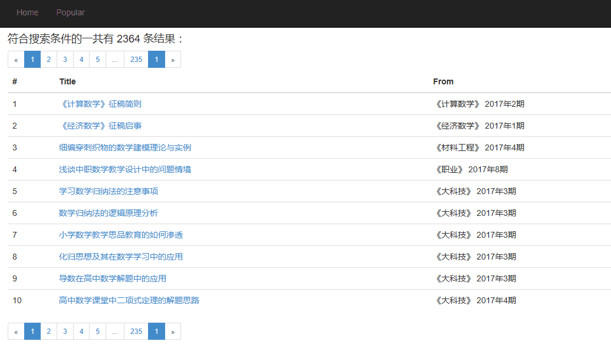
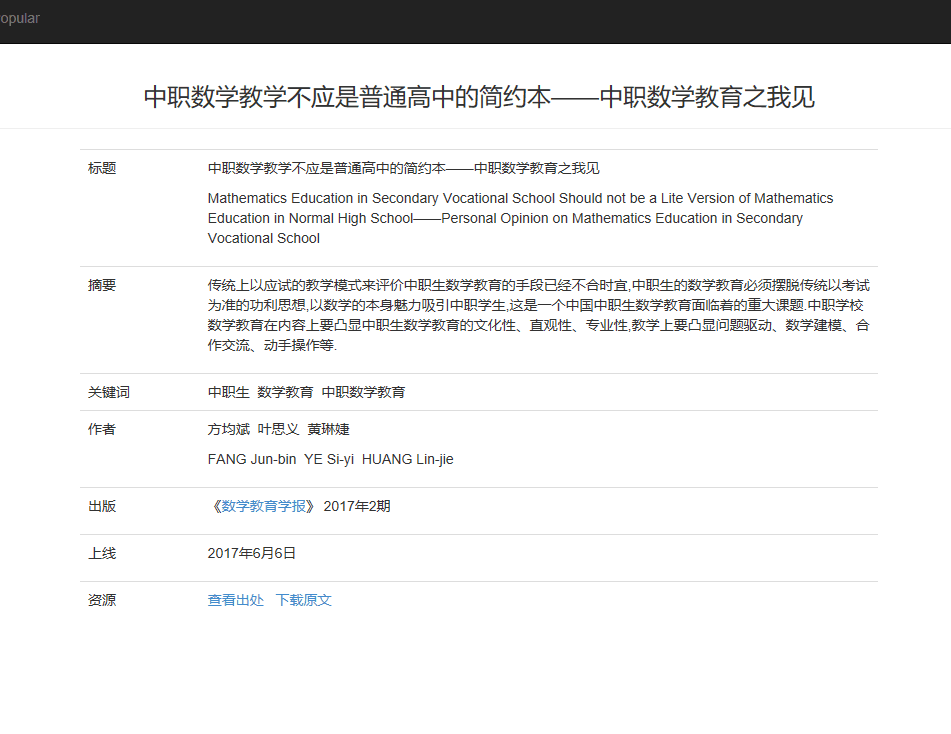

### WanFangData

python2.7
mongodb

******

#### 爬虫部分

###### :point_up: 此爬虫仅针对万方网站的“期刊”模块，如果要爬其他模块，需要对WFbase和WFindex做一些修改

爬虫基于Scrapy和MongoDB
spiders目录下有5个爬虫，按顺序执行:

* `WFbase`
爬取期刊主分类

* `WFindex`
爬取期刊索引，即二级分类（三千个左右）

* `WFcore` 
爬取文章页面（因个人需要只爬了17年的，截至6月份共计爬取23万条，保守估计2016年条数会超过百万）

另外两个patch是修正用的补丁，已经加入到WFcore中，可以忽略

关于settings设置：
	
* `TARGET_YEAR = ['2017']`   
目标时间（依照期刊发行时间筛选），从最新发行刊目开始逆序运行

* `USE_PROXY = 0`
是否使用代理

* `DOWNLOAD_DELAY = 1`
如果不使用代理，此处不能小于1，否则IP会被服务器拒绝，一小时内不能访问

#### Web部分

用爬下来的数据做了web展示，基于Flask
主要功能有：

1. 根据标题、作者等进行搜索
	* 主页
	
	* 搜索结果
	
	* 条目详情
	

2. 输入任意时间范围和领域，查看Top100的热门作者、关键词以及对应的文章数量
	* 热门查询
	
	* 查询结果
	

